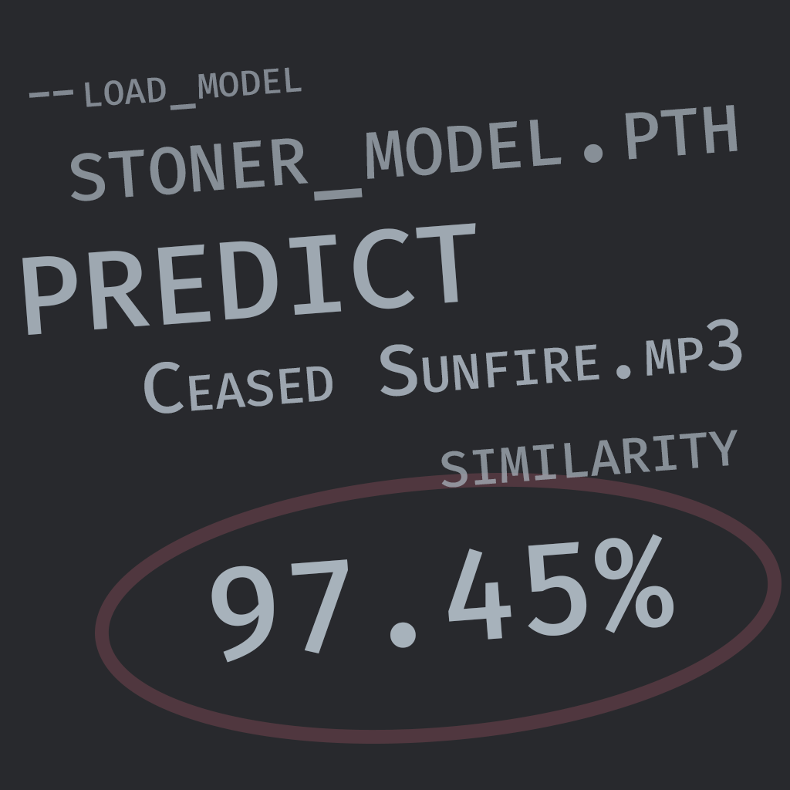

# SMOLPP (Simple Music and Other Listenable Patterns Processor)

SMOLPP is a Python CLI tool that analyzes audio similarity using machine learning.



## Features

- Train models on positive and negative audio examples
- Analyze new audio files for similarity
- Extract audio features using librosa
- Use PyTorch for neural network modeling
- Support for .mp3 and .wav files
- Customizable audio analysis (offset and duration)
- Model saving and loading
- Wildcard support for batch analysis

## Installation

Requires Python 3.11+. Install dependencies using Poetry:

```
poetry install
```

## Usage

### Train a model:

```
poetry run python smolpp.py train --positive_dirs /path/to/positive/samples --negative_dirs /path/to/negative/samples --save_model model.pth
```

### Predict genre of audio:

```
poetry run python smolpp.py predict --input_file /path/to/audio.mp3 --load_model model.pth
```

### Extract features from audio in directories:

```
poetry run python smolpp.py extract --dirs /dir1 /dir2
```

## Testing

Run tests using Behave:

```
poetry run behave
```
